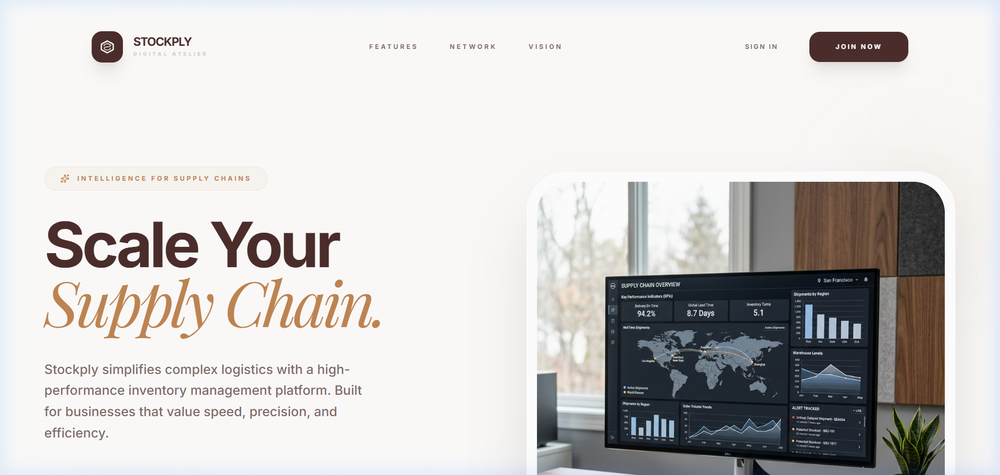
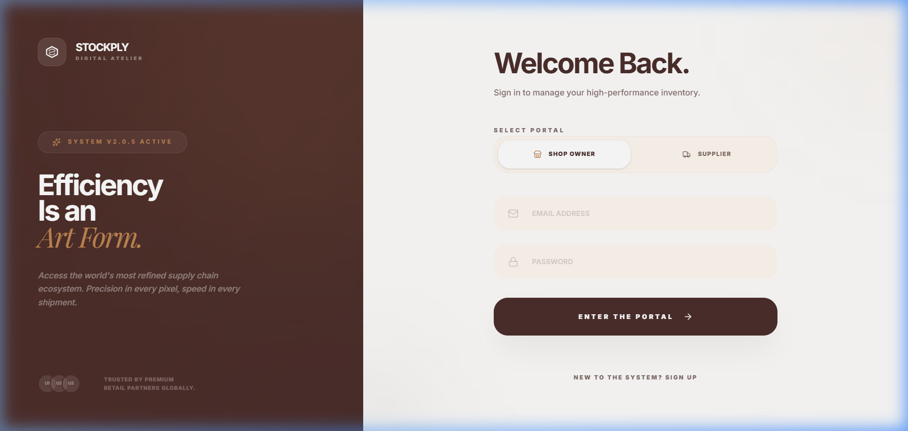
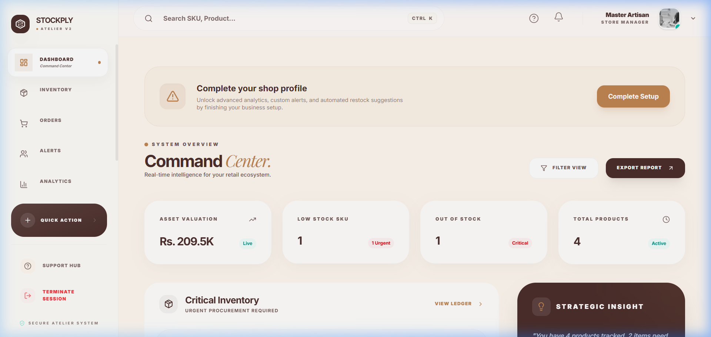
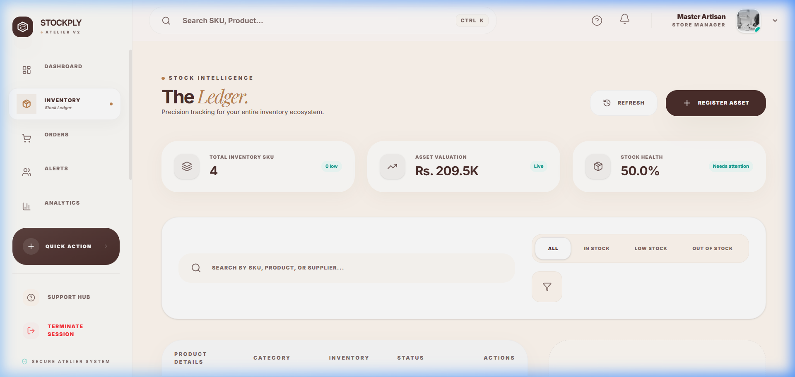

# 📦 Stockply

### **The Digital Atelier for Supply Chain Excellence**

[](https://www.figma.com/design/QrKMtDP4QTgr966N20zdOV/Untitled?node-id=0-1&t=7mfRi0p7h7UuW9fN-1)
[](https://stockply.vercel.app)
[](https://stockply-backend.onrender.com/api/v1)
[](https://documenter.getpostman.com/view/placeholder)
[](https://youtube.com/watch?v=placeholder)

---

## 🛑 Problem Statement

In the current retail landscape, small to medium-sized shop owners often struggle with **opaque supply chains**, **unpredictable stockouts**, and **manual coordination** with suppliers. Existing inventory management systems are either overly complex, expensive, or lack real-time synchronization between the shop and the distributor. This leads to lost revenue, inefficient capital allocation, and fractured business relationships.

## 💡 Solution

**Stockply** is a high-fidelity, full-stack SaaS ecosystem that bridges the gap between retail shops and suppliers. By providing a unified "Digital Atelier," Stockply offers:
- **Real-time Inventory Sync**: Instant visibility into stock levels across the supply chain.
- **Smart Procurement**: Automated low-stock alerts and one-click purchase orders.
- **Data-Driven Analytics**: Visualizing growth, trends, and reliability for both parties.
- **Bespoke UI/UX**: A premium, minimalist interface that reduces cognitive load and enhances productivity.

---

## 🚀 Features

### 🏢 Shop Owner Module
- **Premium Inventory Ledger**: Track products with sub-second latency and intelligent categorization.
- **Automated Alerts**: Real-time notifications for low-stock and out-of-stock items via WebSockets.
- **Supplier Directory**: Search and connect with verified suppliers.
- **Order Management**: Place and track orders with live status updates.
- **Analytics Dashboard**: View total inventory value, low-stock distribution, and procurement history.
- **Supplier Comparison Engine**: Compare partners based on price, reliability, and delivery speed.

### 🏭 Supplier Module
- **Partner Portal**: Manage relationships with multiple retail shops from a single view.
- **Advanced Fulfillment**: Process orders with a dedicated logistics workflow.
- **Stock Management**: Maintain a catalog of products available for distribution.
- **Client Analytics**: Track which partners are driving the most volume and identify growth opportunities.
- **Real-time Notifications**: Get instant alerts when a new order is placed by a shop.

---

## 🛠 Tech Stack

**Frontend:**
- **React 19 + Vite**: Modern, high-performance UI library and build tool.
- **MUI (Material UI)**: Professional component library for high-fidelity layouts.
- **Tailwind CSS 4**: Atomic styling for the "Digital Atelier" aesthetic.
- **Framer Motion**: Hardware-accelerated micro-animations.
- **Redux Toolkit**: Predictable state management for complex supply chain logic.
- **Formik & Yup**: Robust form handling and schema-based validation.

**Backend:**
- **Node.js & Express**: Scalable server-side environment and RESTful API.
- **MongoDB Atlas**: Cloud-native NoSQL database for real-time persistence.
- **Socket.io**: Real-time bidirectional communication for instant notifications.
- **Mongoose**: Elegant object modeling for Node.js.

**DevOps:**
- **Vercel**: Frontend deployment with edge-optimized delivery.
- **Render**: Scalable backend hosting.
- **Git/GitHub**: Version control with atomic commit workflows.

---

## 📂 Project Structure

```bash
stockply/
├── frontend/              # React + Vite frontend application
│   ├── src/
│   │   ├── components/    # Atomic UI elements (GlassCard, Skeletons, Navbar...)
│   │   ├── context/       # Global React Context providers (Shop/Supplier)
│   │   ├── hooks/         # Custom hooks (useSocket, useAuth)
│   │   ├── layouts/       # Structural templates (DashboardLayout)
│   │   ├── pages/         # Route-specific views (Inventory, Dashboard...)
│   │   ├── services/      # Axios API service layer
│   │   └── store/         # Redux state slices
│   └── public/            # Static assets (Favicon, Logo)
└── backend/               # Express REST API
    ├── src/
    │   ├── controllers/   # Business logic and request handling
    │   ├── models/        # Mongoose database schemas
    │   ├── routes/        # Express route definitions
    │   └── services/      # Core service logic (Socket, Auth)
    └── server.js          # Main entry point
```

---

## 📸 Screenshots

*(Add your high-quality screenshots here)*

| Landing Experience | Login Portal |
| :---: | :---: |
|  |  |

| Command Center | Stock Intelligence |
| :---: | :---: |
|  |  |

---

## 🛰 Launch Sequence

1. **Clone & Enter**:
   ```bash
   git clone https://github.com/Priyankkhatri/stockply.git && cd stockply
   ```

2. **Setup Backend**:
   ```bash
   cd backend && npm install
   # Configure .env with MONGODB_URI and JWT_SECRET
   npm run dev
   ```

3. **Setup Frontend**:
   ```bash
   cd frontend && npm install
   # Configure .env.local with VITE_API_URL
   npm run dev
   ```

---

## 🎨 Design Philosophy: Atelier DS

Stockply isn't just an application; it's a digital workspace built on four core pillars:

1.  **Glassmorphism**: Depth and transparency to create hierarchy and focus.
2.  **Kinetic Typography**: Intentional use of *Inter* and *Playfair Display* for maximum legibility and elegance.
3.  **Harmonious Palette**: Warm parchment backgrounds (`#FAF5F0`) with gold (`#C08552`) primary accents.
4.  **Micro-Interactions**: Every click and hover is powered by hardware-accelerated Framer Motion animations.

---

<div align="center">
Built with precision by **Priyank Khatri**.
</div>
